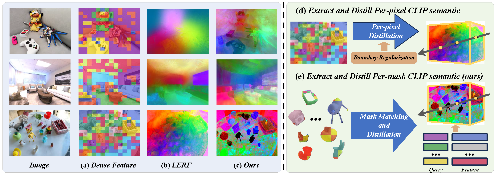

# Fast and Efficient: Mask Neural Fields for 3D Scene Segmentation
Zihan Gao, Lingling Li, Licheng Jiao, Fang Liu, Xu Liu, Wenping Ma, Yuwei Guo, Shuyuan Yang<br>
[Paper](https://arxiv.org/abs/2312.03203](https://arxiv.org/abs/2407.01220))<br>
 

Abstract: *Understanding 3D scenes is a crucial challenge in computer vision research with applications spanning multiple domains. Recent advancements in distilling 2D vision-language foundation models into neural fields, like NeRF and 3DGS, enable open-vocabulary segmentation of 3D scenes from 2D multi-view images without the need for precise 3D annotations. However, while effective, these methods typically rely on the per-pixel distillation of high-dimensional CLIP features, introducing ambiguity and necessitating complex regularization strategies, which adds inefficiency during training. This paper presents MaskField, which enables efficient 3D open-vocabulary segmentation with neural fields from a novel perspective. Unlike previous methods, MaskField decomposes the distillation of mask and semantic features from foundation models by formulating a mask feature field and queries. MaskField overcomes ambiguous object boundaries by naturally introducing SAM segmented object shapes without extra regularization during training. By circumventing the direct handling of dense high-dimensional CLIP features during training, MaskField is particularly compatible with explicit scene representations like 3DGS. Our extensive experiments show that MaskField not only surpasses prior state-of-the-art methods but also achieves remarkably fast convergence. We hope that MaskField will inspire further exploration into how neural fields can be trained to comprehend 3D scenes from 2D models.*

<section class="section" id="BibTeX">
  <div class="container is-max-desktop content">
    <h2 class="title">BibTeX</h2>
    <pre><code>@article{gao2024fast,
  title={Fast and Efficient: Mask Neural Fields for 3D Scene Segmentation},
  author={Gao, Zihan and Li, Lingling and Jiao, Licheng and Liu, Fang and Liu, Xu and Ma, Wenping and Guo, Yuwei and Yang, Shuyuan},
  journal={arXiv preprint arXiv:2407.01220},
  year={2024}
}</code></pre>
  </div>
</section>

## Cloning the Repository

The repository contains submodules, thus please check it out with 
```shell
# SSH
git clone git@github.com:keloee/MaskField.git --recursive
```
or
```shell
# HTTPS
git clone https://github.com/keloee/MaskField.git --recursive
```
## Datasets
In this work, we utilize three datasets: 3DOVS, Replica, and LERF-Mask. Please note the following details regarding each dataset:


The 3DOVS dataset is used in our experiments and can be downloaded by following the instructions in the [3DOVS](https://github.com/Kunhao-Liu/3D-OVS).


The Replica and LERF-Mask dataset is also used in our study. The related experimental code for these dataset is currently being organized and will be made available in the near future. Please stay tuned for further updates.


## Environment Setup
```
conda create -n maskfield python=3.9
conda activate maskfield
pip install torch torchvision
pip install ftfy regex tqdm scikit-image opencv-python configargparse lpips imageio-ffmpeg kornia tensorboard einops
pip install git+https://github.com/openai/CLIP.git

```
download the checkpoints of SAM from [here](https://github.com/facebookresearch/segment-anything) and modify the sam checkpoint path in the extract_feature.py

## Pipeline
- **Step 1: Extract Features and SAM masks.**
  Change the path of data in extract_feature.py and run
  ```
  python extract_feature.py --scene_name $name
  ```
- **Step 2: Train the reconstruction model.**
  ```
  python train.py --config configs/reconstruction.txt
  ```
- **Step 3: Train the segmentation model.**
  ```
  # office_desk for example
  python train_seg_3dovs.py --config configs/office_desk.txt
  ```


## TODO list:
- [x] release the code of the NeRF version
- [ ] release the code of the open vocabulary query
- [ ] release the code of the 3DGS version
- [ ] release the preprocessed dataset and the pretrained model

This project is still under development. Please feel free to raise issues or contact me at z1han_gao@163.com.
